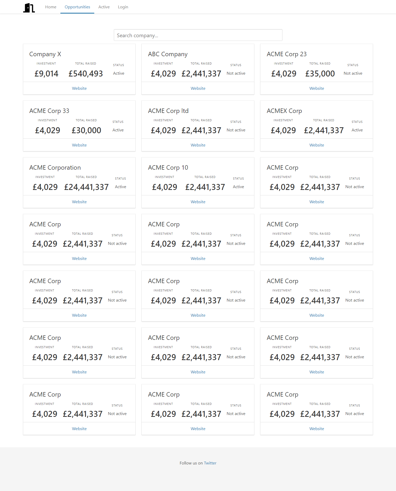

# Front-end Challenge

This project is a front-end challenge using:  

1. axios
2. bulma
3. express
4. vue
5. vue-router
6. vue-server-renderer
7. vuex

## Requirements

Install Node (v8.11.2)

    https://nodejs.org/en/

## Getting Started

1. Clone this repository

    git clone https://github.com/kpchiragowni/sr.git

    cd sr

2. Install the npm packages

    npm i

3. To run project locally. The build artifacts will be stored in the `dist/` directory.

   npm start

## Build

***

Run `ng run build` to build the project. The build artifacts will be stored in the `build/` directory.

## Running unit tests

Run `ng run test` to execute the unit tests via [Karma](https://karma-runner.github.io).